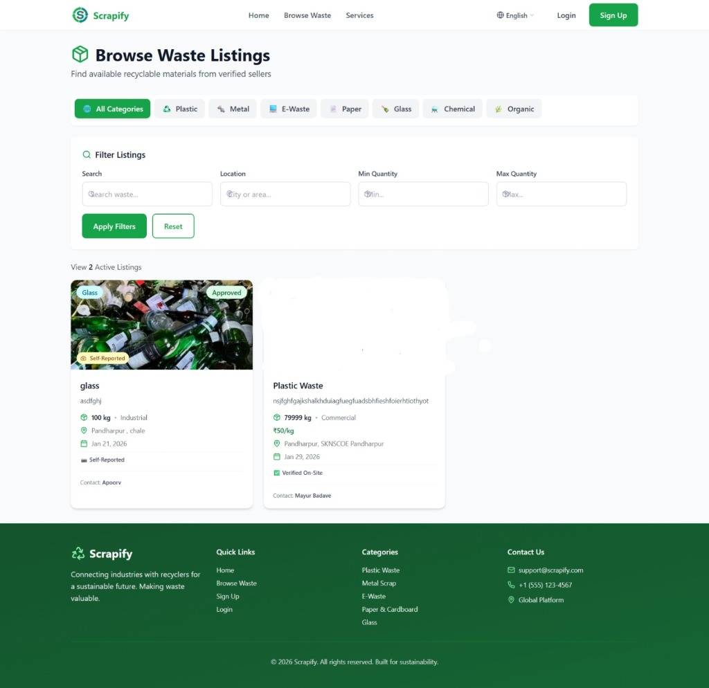
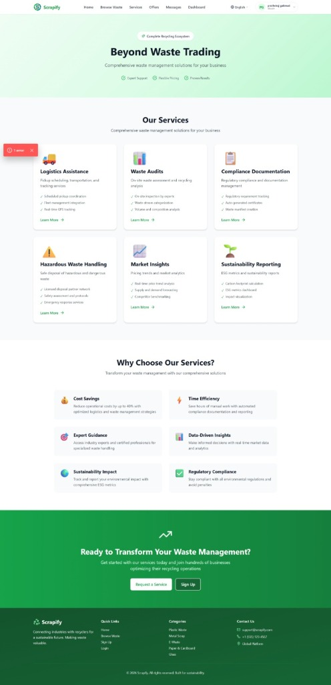
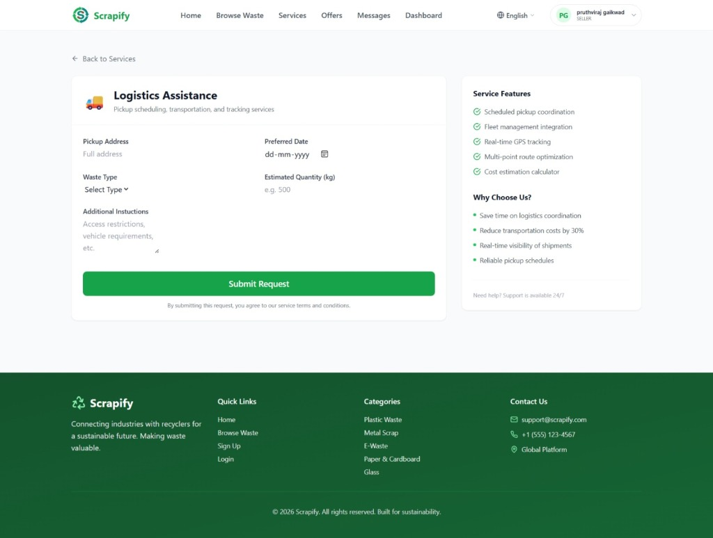
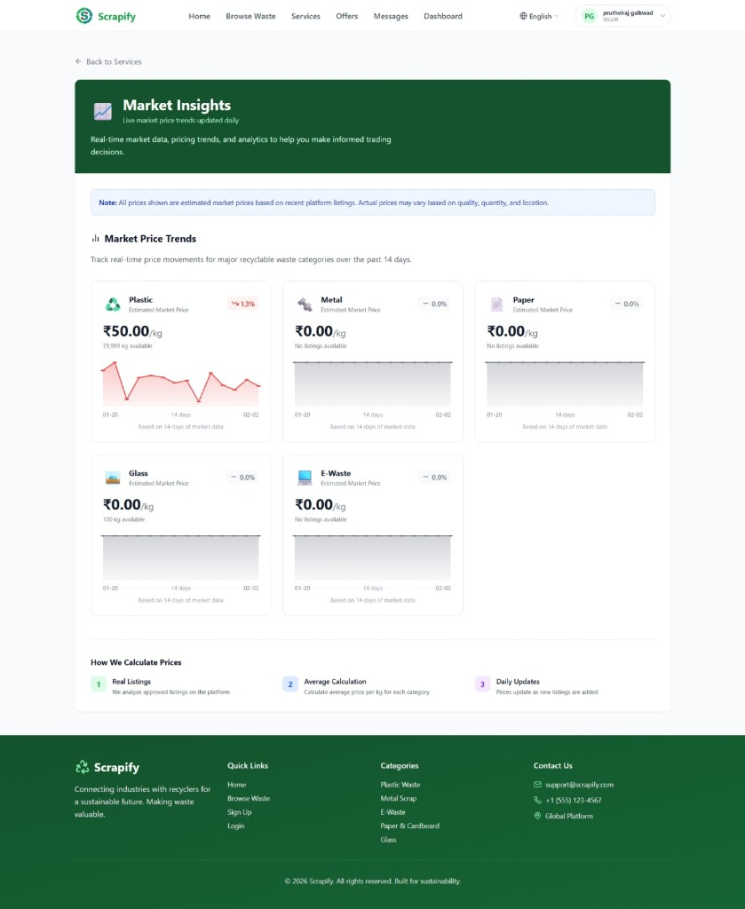
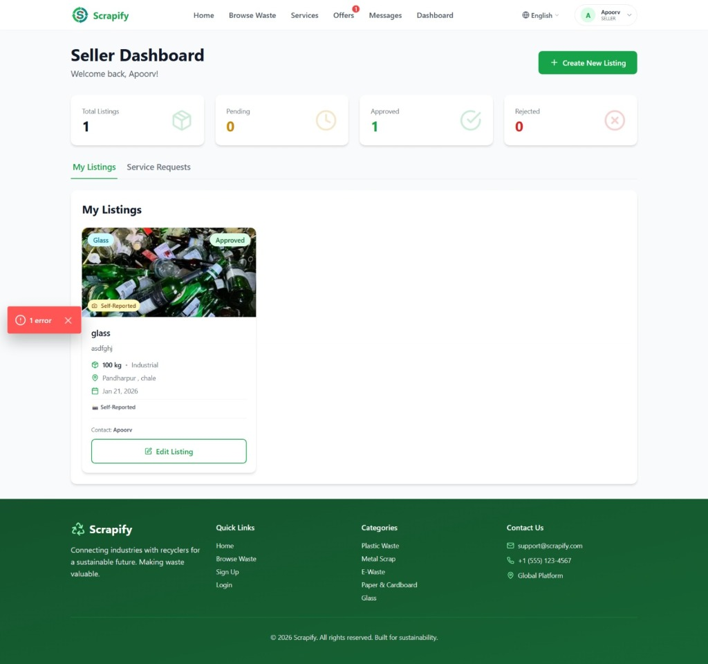
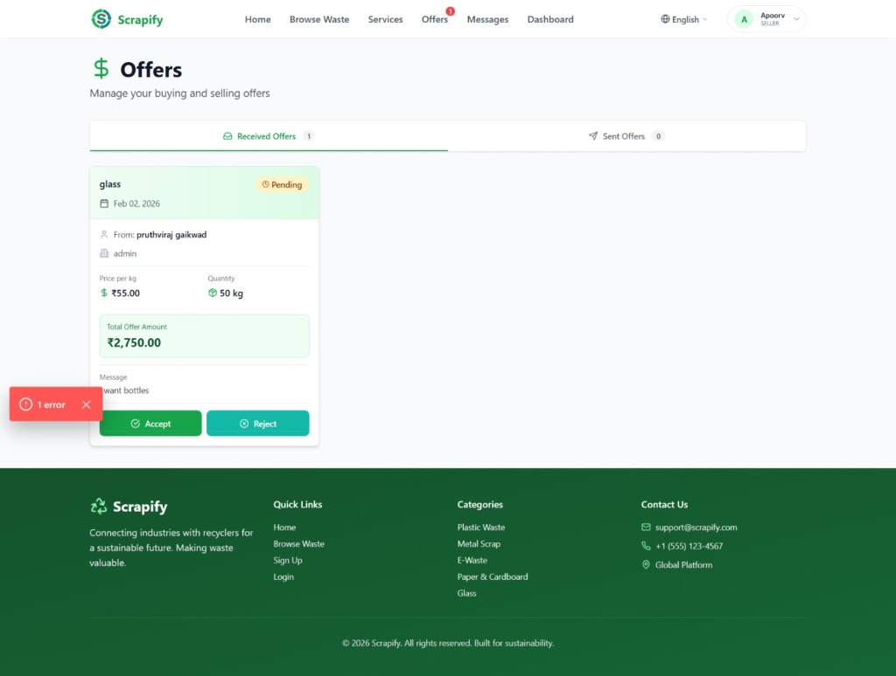
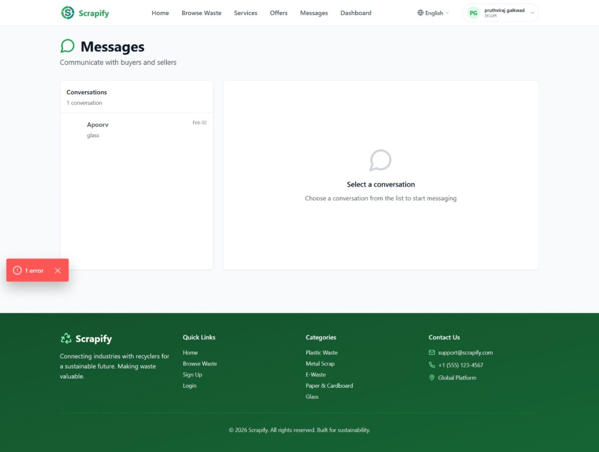
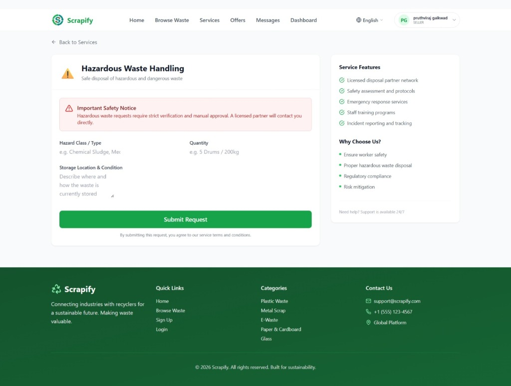
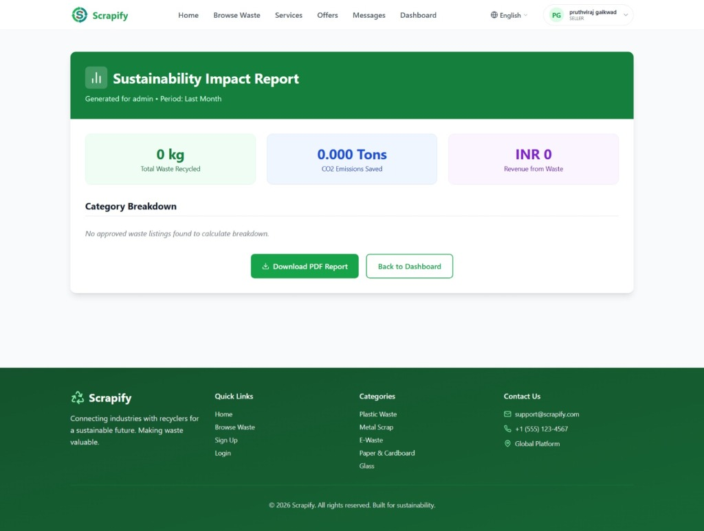

<div align="center">
  
  
  # Scrapify - Recyclable Waste Trading Platform
  
  A full-stack web application connecting waste sellers with buyers, promoting sustainable waste management and recycling in India.
</div>


## 🏗️ Project Structure

This project follows a **monorepo structure** with clear separation between frontend and backend:

```
scrapify/
├── client/                 # Next.js Frontend Application
│   ├── src/
│   │   ├── app/           # Next.js App Router pages
│   │   ├── components/    # React components
│   │   ├── hooks/         # Custom React hooks
│   │   └── lib/           # Client-side utilities
│   ├── public/            # Static assets
│   └── package.json
│
├── server/                 # Express.js Backend API
│   ├── src/
│   │   ├── controllers/   # Request handlers
│   │   ├── routes/        # API routes
│   │   ├── services/      # Business logic
│   │   ├── models/        # Data models
│   │   ├── middleware/    # Express middleware
│   │   └── utils/         # Server utilities
│   └── package.json
│
├── shared/                 # Shared Code
│   ├── types/             # TypeScript types/interfaces
│   └── constants/         # Shared constants
│
└── package.json           # Root monorepo configuration
```

## 🚀 Quick Start

### Prerequisites

- Node.js >= 18.0.0
- npm >= 9.0.0

### Installation

1. **Clone the repository**
   ```bash
   git clone <repository-url>
   cd scrapify
   ```

2. **Install dependencies for all workspaces**
   ```bash
   npm run install:all
   ```

   Or install individually:
   ```bash
   # Root dependencies
   npm install

   # Client dependencies
   cd client && npm install

   # Server dependencies
   cd ../server && npm install
   ```

3. **Set up environment variables**
   ```bash
   # Server environment
   cd server
   copy .env.example .env
   # Edit .env with your configuration
   ```

### Development

**Run both client and server concurrently:**
```bash
npm run dev
```

**Run individually:**
```bash
# Frontend only (runs on http://localhost:3000)
npm run dev:client

# Backend only (runs on http://localhost:5000)
npm run dev:server
```

### Building for Production

```bash
# Build both client and server
npm run build

# Build individually
npm run build:client
npm run build:server
```

### Running Production Build

```bash
npm start
```

## 📁 Detailed Structure

### Client (Frontend)

**Technology Stack:**
- Next.js 14 (App Router)
- React 18
- TypeScript
- Tailwind CSS
- Leaflet (Maps)
- Lucide React (Icons)

**Key Features:**
- Multilingual support (English, Hindi, Marathi)
- Responsive design
- Interactive maps
- Photo verification
- Market insights with price graphs
- Service request management

### Server (Backend)

**Technology Stack:**
- Node.js
- Express.js
- TypeScript
- CORS enabled

**API Structure:**
- RESTful API design
- Modular controller/route architecture
- Middleware for authentication (to be implemented)
- Ready for database integration

**API Endpoints (Planned):**
- `/api/auth/*` - Authentication
- `/api/listings/*` - Waste listings CRUD
- `/api/services/*` - Service requests
- `/api/users/*` - User management

### Shared

**Contents:**
- TypeScript interfaces and types
- Shared constants (waste categories, enums)
- Common utilities

## 🔧 Configuration Files

### Root `package.json`
- Workspace configuration
- Scripts to run/build all projects
- Shared dev dependencies

### Client Configuration
- `next.config.js` - Next.js configuration
- `tailwind.config.js` - Tailwind CSS setup
- `tsconfig.json` - TypeScript with path aliases

### Server Configuration
- `tsconfig.json` - Node.js TypeScript setup
- `.env` - Environment variables

## 🌐 Environment Variables

### Server (.env)
```env
PORT=5000
NODE_ENV=development
CLIENT_URL=http://localhost:3000
```

## 📝 Development Workflow

1. **Frontend Development:**
   - Work in `client/src/`
   - Use `@/` alias for imports (e.g., `@/components/...`)
   - Use `@shared/` for shared types
   - Hot reload enabled

2. **Backend Development:**
   - Work in `server/src/`
   - Use `@shared/` for shared types
   - Auto-restart with ts-node-dev

3. **Adding Shared Types:**
   - Add to `shared/types/`
   - Export from `shared/types/index.ts`
   - Import in client/server using `@shared/types`

## 🎯 Key Features

- **Waste Listings:** Browse, create, and manage recyclable waste listings
- **User Roles:** Seller and Admin dashboards
- **Services:** Request logistics, audits, compliance, and more
- **Market Insights:** Real-time price trends for recyclable materials
- **Multilingual:** Support for English, Hindi, and Marathi
- **Location-based:** Interactive maps for waste location
- **Photo Verification:** Upload and verify waste photos

## 📸 Screenshots

### Home Page

*Landing page showcasing the platform's value proposition and key features*

### Browse Waste Listings

*Search and filter recyclable waste listings by category, location, and quantity*

### Services

*Comprehensive waste management solutions including logistics, audits, and compliance*

### Logistics Service

*Request pickup scheduling, transportation, and tracking services*

### Market Insights

*Real-time market price trends and analytics for informed trading decisions*

### Seller Dashboard

*Manage your waste listings, track approvals, and view service requests*

### Offers Management

*Receive, review, and accept/reject offers from buyers*

### Messaging System

*Communicate directly with buyers and sellers about listings*

### Hazardous Waste Handling

*Specialized service for safe disposal of hazardous and dangerous waste*

### Sustainability Report

*Track environmental impact with detailed sustainability metrics and reports*

## 🔐 Authentication

Currently using localStorage-based authentication (development mode).
Ready for integration with:
- JWT tokens
- OAuth providers
- Database-backed sessions

## 📊 Future Enhancements

- [ ] Database integration (MongoDB/PostgreSQL)
- [ ] Real-time notifications
- [ ] Payment gateway integration
- [ ] Mobile app (React Native)
- [ ] Advanced analytics dashboard
- [ ] AI-powered waste classification

## 🤝 Contributing

1. Create a feature branch
2. Make your changes
3. Test thoroughly
4. Submit a pull request

## 📄 License

[Your License Here]

## 👥 Team

[Your Team Information]

---

**Built with ❤️ for a sustainable future**
